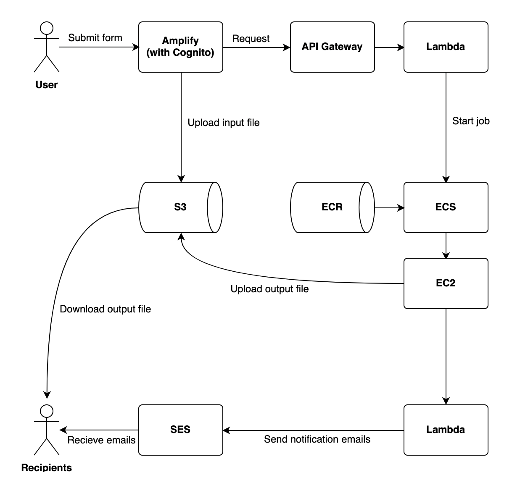
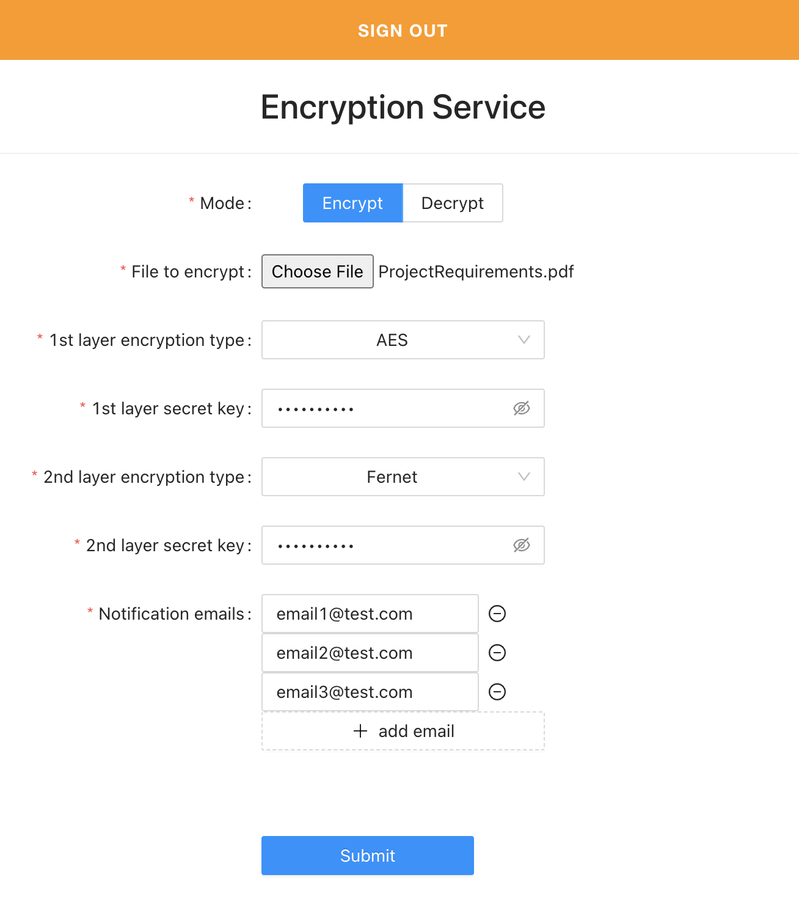
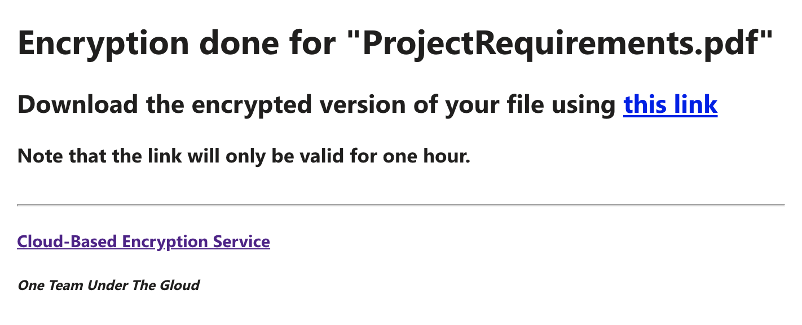

# Cloud-Based Encryption Service

A React web app that allows users to encrypt and decrypt files using AWS cloud resources.

## One Team Under The Gloud

- Jan Foksinski
- Jonathan Frees
- Eric Latham
- Jack Vogt
- Kelvin Yi

### Local Development Environment

#### Editing the backend

Use the AWS console or the [AWS Amplify CLI](https://docs.amplify.aws/cli/)

#### Editing the frontend

1. `npm install`
2. `npm run start`
3. Edit the code in [src/](src/)

### Application Model



#### Encryption Process

1. The user signs into the Amplify web app.


2. The user selects a file to encrypt.
3. The user selects one or two encryption layers.
4. For each selected encryption layer, the user enters a secret key.
5. The user specifies one or more email addresses to send encryption completion notification emails to.



6. The frontend uploads the user-selected file to an S3 bucket input file folder.
7. The frontend sends a `/encrypt` request to the backend including the URL of the uploaded file in S3.
8. The backend forwards the request (through a Lambda function) to [an ECS-hosted encryption service](https://gitlab.com/uab-eolatham/cs/443/project-backend).
9. The ECS-hosted encryption service encrypts the file at the URL given in the request and uploads the encrypted version of the file to an S3 bucket output file folder.
10. The ECS-hosted encryption service invokes a Lambda function that uses SES to send encryption completion notification emails with a link to download the encrypted version of the user's file to all of the email addresses specified by the user.



#### Decryption Process

The decryption process is essentially the same as the [encryption process](#encryption-process); just replace _encrypt_ with _decrypt_.

#### Important Details

- The frontend is based on [this example](https://github.com/aws-samples/create-react-app-auth-amplify).
- Encryption layer options include [AES](https://cryptography.io/en/latest/hazmat/primitives/symmetric-encryption/#cryptography.hazmat.primitives.ciphers.Cipher) and [Fernet](https://cryptography.io/en/latest/fernet).
- User uploads are done based on [this guide](https://docs.amplify.aws/lib/storage/getting-started/q/platform/js/).
- Files stored in S3 are automatically deleted after a week.
- The ECS-hosted encryption service is a Python API built with [FastAPI](https://fastapi.tiangolo.com/) and [cryptography](https://cryptography.io/en/latest).
- The ECS-hosted encryption service [generates pre-signed URLs](https://boto3.amazonaws.com/v1/documentation/api/latest/reference/services/s3.html#S3.Client.generate_presigned_url) to send in completion notification emails so that users can download output files from S3.

#### Endpoints

##### `/{encrypt|decrypt}`

Method: POST

Request body:

```js
type EncryptionLayer = {
  encryption_type: "aes" | "fernet", // User-selected encryption/decryption type
  secret_key: string, // User-specified secret key
};
type RequestBody = {
  file_name: string, // Original name of the input file
  input_object_key: string, // S3 object key the input file was uploaded under
  output_object_key: string, // S3 object key to upload the output file under
  encryption_layers: EncryptionLayer[], // List of encryption/decryption layers to apply
  notification_emails: string[], // List of emails to send completion notifications to
};
```

Limits:

- The number of encryption layers must be 1 or 2.
- The secret key for an encryption layer must be 32 bytes or smaller.
